A set of JMH benchmarks for various JVM constructions, written in Java and Kotlin.

Build:
```
mvn clean package
```
Tests includes:
* Loops through lists and arrays
* Comparing different DataTime API available for JVM, like joda.time, time4j, java.util.Calendar, java.time, threeten.bp. Comparing typical operations plusDays, plusWeeks, daysBetween, etc.
* Comparing mutable and immutable collections

### Mutable vs immutable collections
Comparision between:
* Standard JDK mutable collections
* Persistent collections https://github.com/hrldcpr/pcollections
* Eclipse collections mutable and immutable https://github.com/eclipse/eclipse-collections
* Guava immutable collections
* Java immutable collections https://github.com/brianburton/java-immutable-collections
* Androidx collections like ArraySet, SparseArray

#### Lists
###### Add new item to a list 1000 000 times
| Collection | Score _ns/op_ |
| ------ | ------ |
| ArrayList | 4854015 |
| JImmutableStack | 4822985 |
| LinkedList | 5921889 |
| ConsPStack | 6740323 |
| JImmutableList | 181495708 |
| TreePVector | 537843369 |
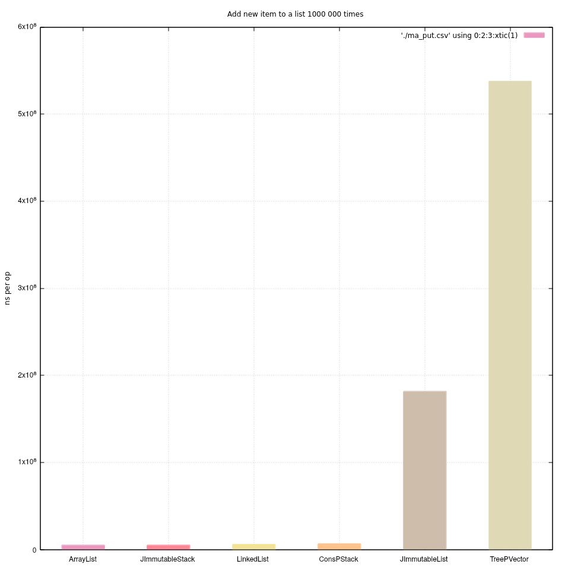

###### Check if list contains an item with 100 000 items
| Collection | Score _ns/op_ |
| ------ | ------ |
| ArrayList | 21330 |
| ConsPStack | 26286 |
| JImmutableStack | 32304 |
| Stack | 85272 |
| LinkedList | 160295 |
| JImmutableList | 882873 |
| TreePVector | 2061153 |
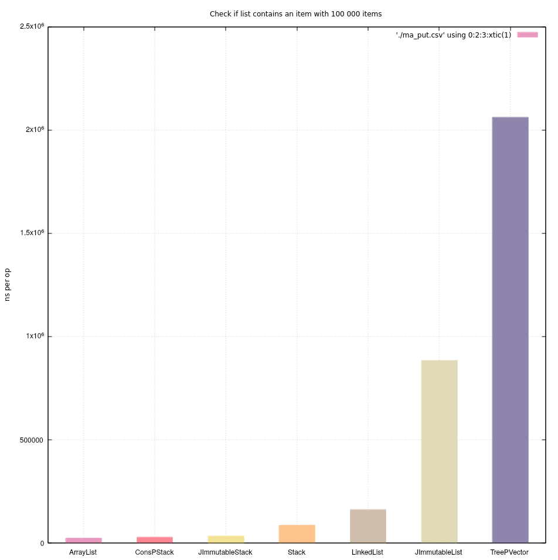

###### Iterate through list and sum up all its 200 000 items 
| Collection | Score _ns/op_ |
| ------ | ------ |
| ArrayList | 239669 |
| JImmutableStack | 717536 |
| ConsPStack | 819618 |
| LinkedList | 853572 |
| TreePVector | 3996926 |
| JImmutableList | 4090843 |
| Stack | 5069004 |
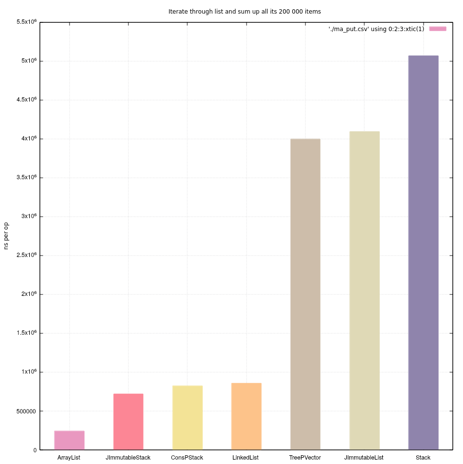

###### Insert 100 000 items in the middle of the list 
| Collection | Score _ns/op_ |
| ------ | ------ |
| JImmutableList | 20964836 |
| TreePVector | 71693585 |
| ArrayList | 353459261 |
| ArrayList _with predefined size_ | 353432854 |
| Stack | 354646074 |
| LinkedList | 4779051906 |
| ConsPStack | StackOverflowError |
ConsPStack uses recursion to add a new element, so it get crashed.
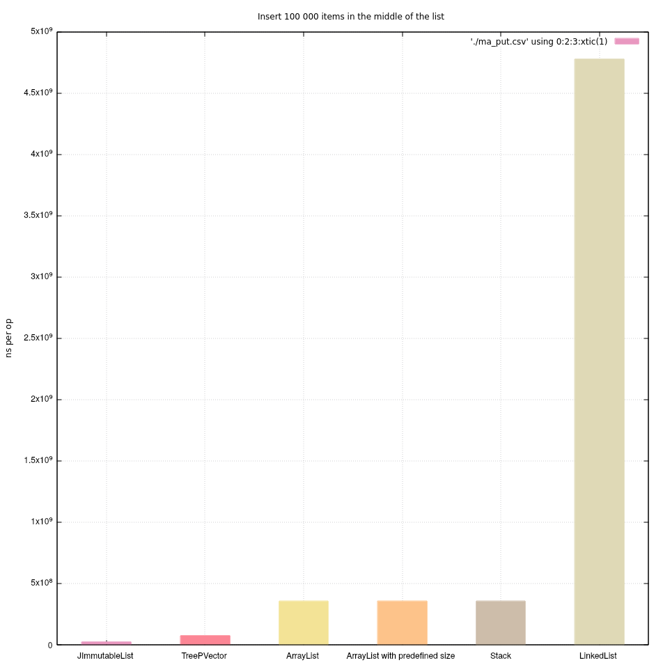

###### Remove 74 900 items from the middle of a list with 100 000 items
| Collection | Score _ns/op_ |
| ------ | ------ |
| JImmutableList | 19354452 |
| Stack | 4442481048 |
| ArrayList | 4802332800 |
| LinkedList | 10669939267 |
| TreePVector | 71387068447 |
| ConsPStack | StackOverflowError |
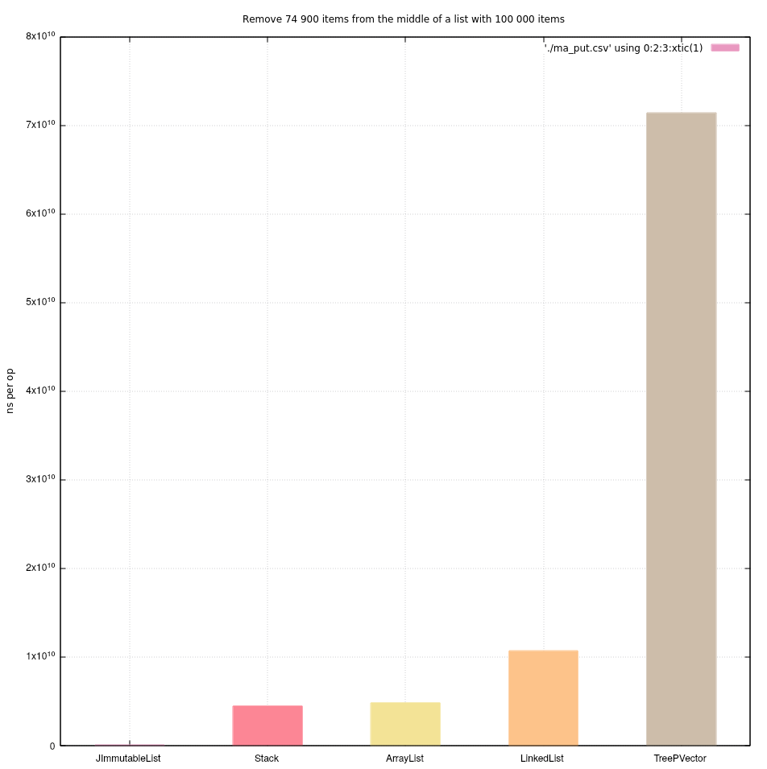

#### Sets
###### Add new item to a set 1000 000 times
| Collection | Score _ns/op_ |
| ------ | ------ |
| HashSet | 130738821 |
| JImmutableSet | 434394386 |
| JImmutableMultiset | 568090231 |
| TreeSet | 782037380 |
| MapPSet | 1011342491 |
| ArraySet | 41545653723 |
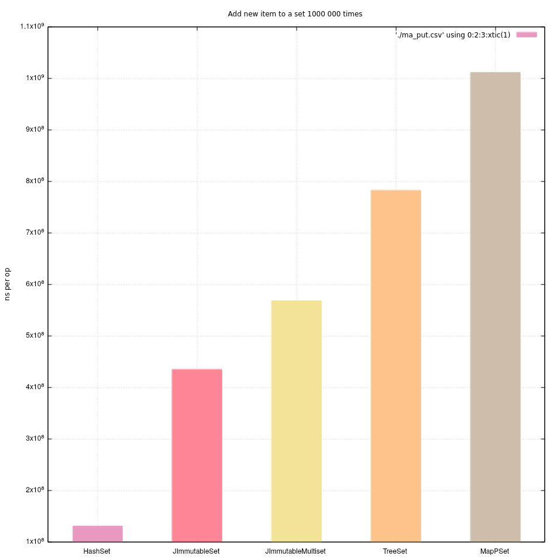

###### Check if set contains an item with 100 000 items
| Collection | Score _ns/op_ |
| ------ | ------ |
| HashSet | 9.2 |
| TreeSet | 23.5 |
| JImmutableSet | 27.0 |
| ArraySet | 27.3 |
| JImmutableMultiset | 28.3 |
| MapPSet | 54.5 |
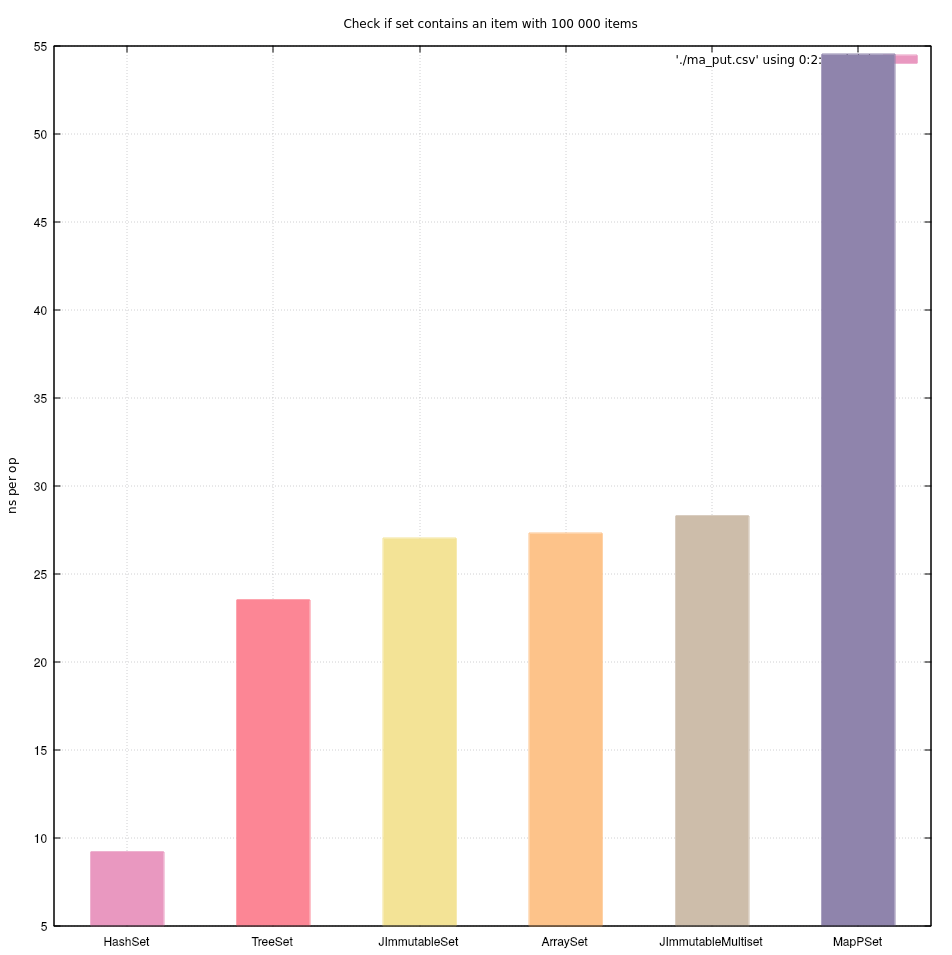

###### Iterate through set and sum up all its 200 000 items 
| Collection | Score _ns/op_ |
| ------ | ------ |
| ArraySet | 444388 |
| HashSet | 1984468 |
| TreeSet | 2321796 |
| MapPSet | 10379233 |
| JImmutableMultiset | 19757874 |
| JImmutableSet | 19788659 |
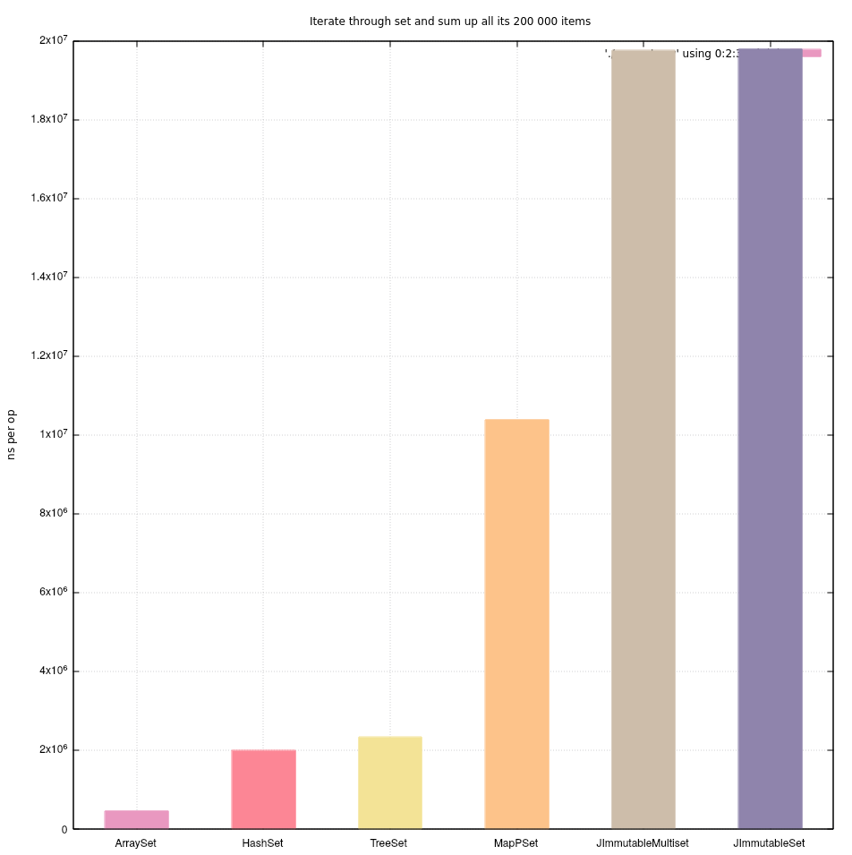

###### Remove 49 900 items from the set with 100 000 items
| Collection | Score _ns/op_ |
| ------ | ------ |
| HashSet | 157829 |
| ArraySet | 1637993 |
| TreeSet | 1683893 |
| MapPSet | 7255522 |
| JImmutableSet | 9835587 |
| JImmutableMultiset | 11816974 |
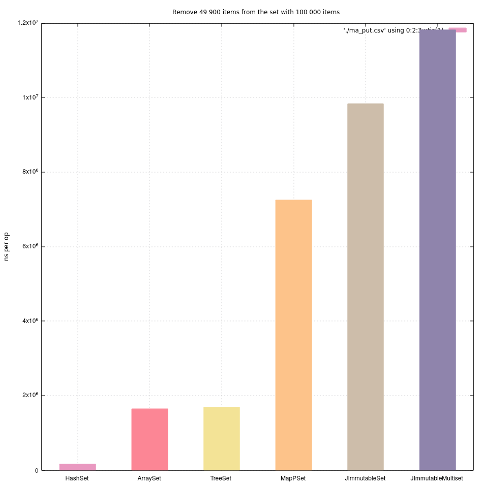

#### Maps
###### Put new value to a map 100 000 times
| Collection | Score _ns/op_ |
| ------ | ------ |
| EclipseUnifiedMap | 4616675 |
| HashMap | 5903254 | 
| LinkedHashMap | 6696584 | 
| EclipseConcurrentHashMap | 9804946 | 
| ConcurrentHashMap | 11176820 | 
| JImmutableSetMap | 34985327 | 
| JImmutableMap | 39071872 | 
| JImmutableListMap | 40579842 | 
| IntPMap | 49561724 | 
| JImmutableSortedMap | 62281212 | 
| HashPMap | 70886001 | 
| SparseArray | 316250855 | 
| ArrayMap | 506483387 | 
| EclipseImmutableMap | 112506483387 | 
| GuavaImmutableMap | 212506483387 | 


EclipseImmutableMap and GuavaImmutableMap totally recreate map when adding new element, that's why they are so slow

###### Check if map contains a key with 500 000 items
| Collection | Score _ns/op_ |
| ------ | ------ |
| HashMap | 5.4 |
| LinkedHashMap | 5.6 |
| EclipseMutableMap | 6.4 |
| EclipseImmutableMap | 6.6 |
| GuavaImmutableMap | 7.4 |
| SparseArray | 28.7 |
| ArrayMap | 31.2 |
| JImmutableMap | 31.5 |
| TreeMap | 39.6 |
| IntTreePMap | 46.3 |
| HashPMap | 72.7 |
| JImmutableSortedMap | 80.0 |
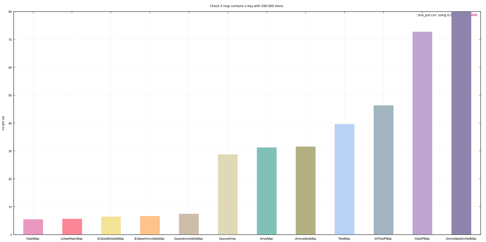

###### Check if map contains a value 500 000 items
| Collection | Score _ns/op_ |
| ------ | ------ |
| SparseArray | 14385 |
| ArrayMap | 31600 |
| GuavaImmutableMap | 68962 |
| EclipseImmutableMap | 205202 |
| HashMap | 372728 |
| EclipseMutableMap | 433659 |
| LinkedHashMap | 484310 |
| TreeMap | 489393 |
| IntTreePMap | 844354 |
| HashPMap | 1109556 |
| JImmutableSortedMap | 3297182 |
| JImmutableMap | 7285167 |

###### Iterate through map and sum up all its 100 000 items 
| Collection | Score _ns/op_ |
| ------ | ------ |
| ArrayMap | 232476 |
| EclipseMutableMap | 446745 |
| GuavaImmutableMap | 520165 |
| EclipseImmutableMap | 567447 |
| HashMap | 595179 |
| TreeMap | 682662 |
| IntTreePMap | 2403714 |
| HashPMap | 3510105 |
| JImmutableSortedMap | 7237417 |
| JImmutableMap | 13431226 |
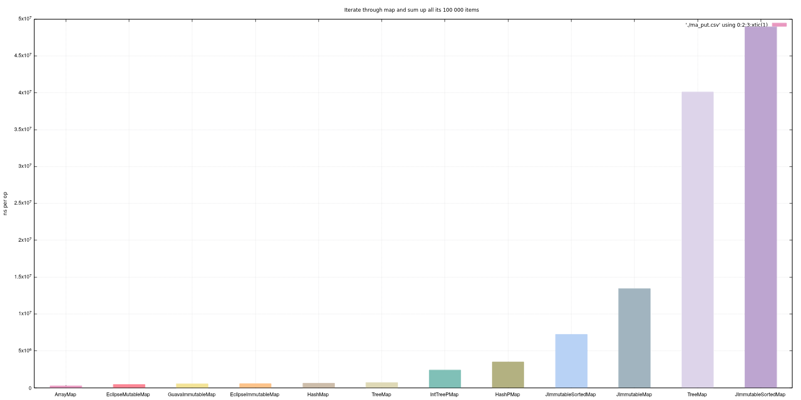

###### Random access to map with 100 000 items, 100 000 times
| Collection | Score _ns/op_ |
| ------ | ------ |
| GuavaImmutableMap | 4168899 |
| EclipseMutableMap | 4190743 |
| EclipseImmutableMap | 4338962 |
| LinkedHashMap | 7382515 |
| HashMap | 7877748 |
| JImmutableMap | 16173780 |
| SparseArray | 16062088 |
| ArrayMap | 17775730 |
| IntTreePMap | 27638864 |
| HashPMap | 38952774 |
| TreeMap | 40107206 |
| JImmutableSortedMap | 48937962 |
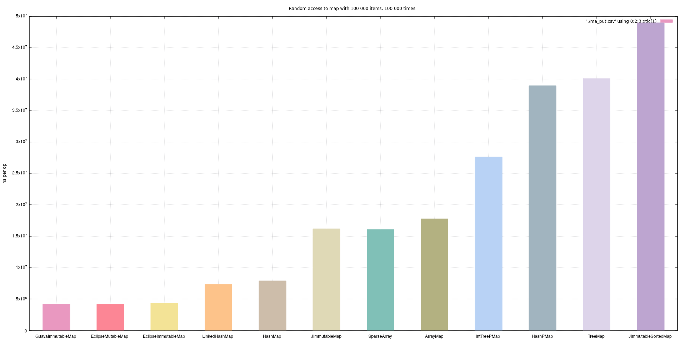

###### Remove 99 900 items from the middle of map with 100 000 items
| Collection | Score _ns/op_ |
| ------ | ------ |
| LinkedHashMap | 303094 |
| HashMap | 315987 |
| EclipseMutableMap | 434462 |
| ArrayMap | 2422169 |
| TreeMap | 3033837 |
| SparseArray | 4741959 |
| IntTreePMap | 10098933 |
| HashPMap | 11884758 |
| JImmutableSortedMap | 15688043 |
| JImmutableMap | 20559828 |
| EclipseImmutableMap | 128161834031 |
| GuavaImmutableMap | 231715633402 |
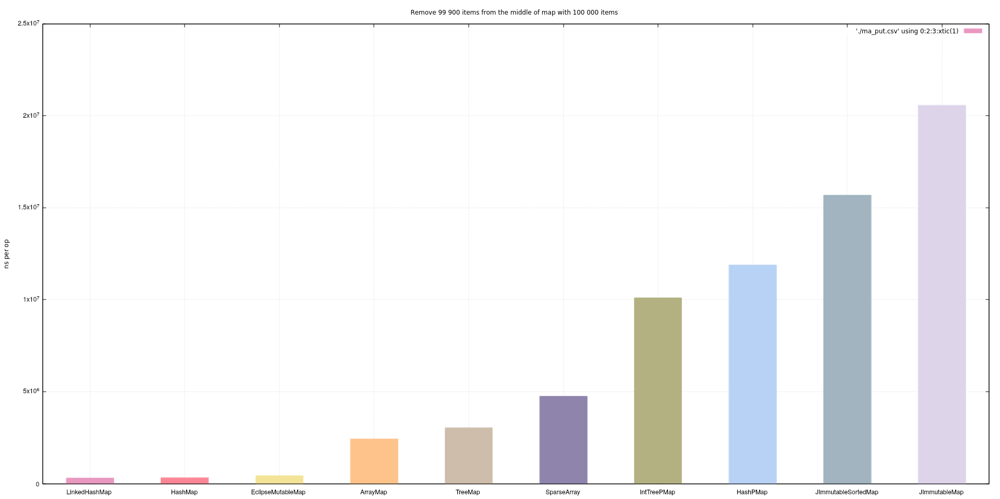